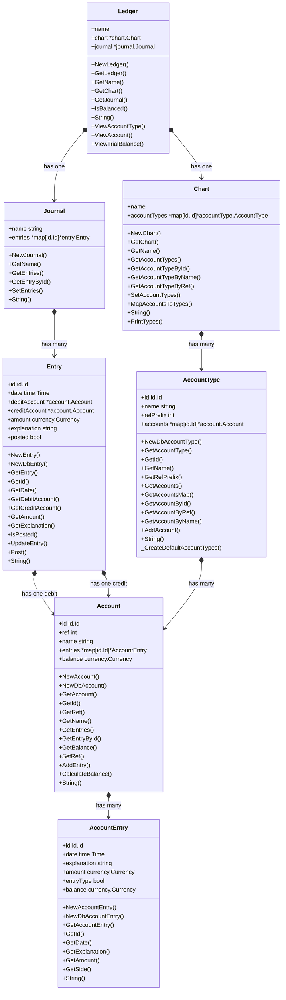

```mermaid
classDiagram
	Entry *--> Account : has one debit
	Entry *--> Account : has one credit
	Journal *--> Entry : has many
	Account *--> AccountEntry : has many
	AccountType *--> Account : has many
	Chart *--> AccountType : has many
	Ledger *--> Chart : has one
	Ledger *--> Journal : has one

	class Ledger {
		+name
		+chart *chart.Chart
		+journal *journal.Journal
		+NewLedger()
		+GetLedger()
		+GetName()
		+GetChart()
		+GetJournal()
		+IsBalanced()
		+String()
		+ViewAccountType()
		+ViewAccount()
		+ViewTrialBalance()
	}

	class Chart {
		+name
		+accountTypes *map[id.Id]*accountType.AccountType
		+NewChart()
		+GetChart()
		+GetName()
		+GetAccountTypes()
		+GetAccountTypeById()
		+GetAccountTypeByName()
		+GetAccountTypeByRef()
		+SetAccountTypes()
		+MapAccountsToTypes()
		+String()
		+PrintTypes()
	}

	class AccountType {
		+id id.Id
		+name string
		+refPrefix int
		+accounts *map[id.Id]*account.Account
		+NewDbAccountType()
		+GetAccountType()
		+GetId()
		+GetName()
		+GetRefPrefix()
		+GetAccounts()
		+GetAccountsMap()
		+GetAccountById()
		+GetAccountByRef()
		+GetAccountByName()
		+AddAccount()
		+String()
		_CreateDefaultAccountTypes()
	}

	class Account {
		+id id.Id
		+ref int
		+name string
		+entries *map[id.Id]*AccountEntry
		+balance currency.Currency
		+NewAccount()
		+NewDbAccount()
		+GetAccount()
		+GetId()
		+GetRef()
		+GetName()
		+GetEntries()
		+GetEntryById()
		+GetBalance()
		+SetRef()
		+AddEntry()
		+CalculateBalance()
		+String()
	}

	class AccountEntry {
		+id id.Id
		+date time.Time
		+explanation string
		+amount currency.Currency
		+entryType bool
		+balance currency.Currency
		+NewAccountEntry()
		+NewDbAccountEntry()
		+GetAccountEntry()
		+GetId()
		+GetDate()
		+GetExplanation()
		+GetAmount()
		+GetSide()
		+String()
	}

	class Journal {
		+name string
		+entries *map[id.Id]*entry.Entry
		+NewJournal()
		+GetName()
		+GetEntries()
		+GetEntryById()
		+SetEntries()
		+String()
	}

	class Entry {
		+id id.Id
		+date time.Time
		+debitAccount *account.Account
		+creditAccount *account.Account
		+amount currency.Currency
		+explanation string
		+posted bool
		+NewEntry()
		+NewDbEntry()
		+GetEntry()
		+GetId()
		+GetDate()
		+GetDebitAccount()
		+GetCreditAccount()
		+GetAmount()
		+GetExplanation()
		+IsPosted()
		+UpdateEntry()
		+Post()
		+String()
	}
```