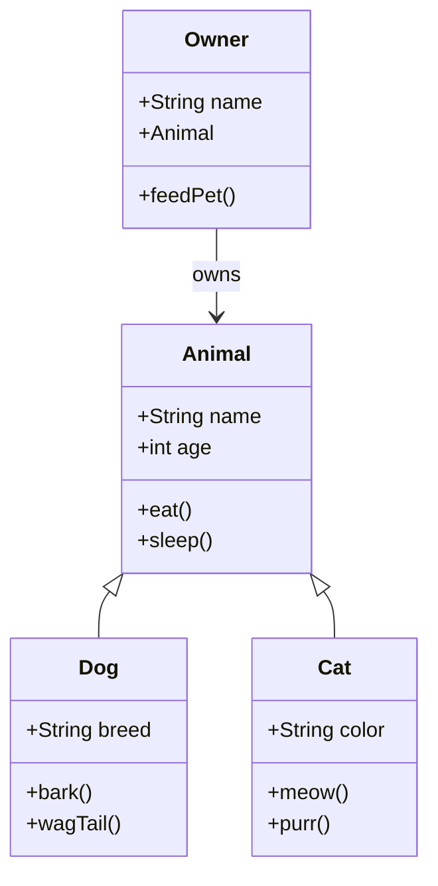

```mermaid
classDiagram
	class Animal {
		+String name
		+int age
		+eat()
		+sleep()
	}

	class Dog {
		+String breed
		+bark()
		+wagTail()
	}

	class Cat {
		+String color
		+meow()
		+purr()
	}

	Animal <|-- Dog
	Animal <|-- Cat

	class Owner {
		+String name
		+Animal
		+feedPet()
	}

	Owner --> Animal : owns
```